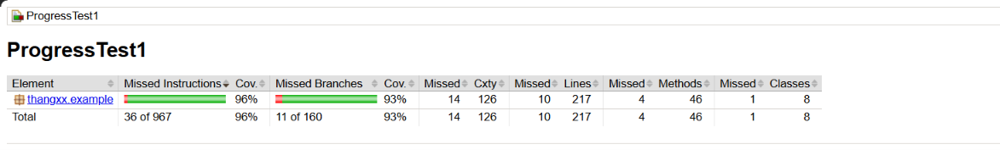

# SWT301 -- ProgressTest 1

## Unit Testing with JUnit 5 -- Account Management

> **Course:** SWT301 -- Software Testing\
> **Project:** ProgressTest1 -- Account Management\
> **Testing Framework:** JUnit 5\
> **Build Tool:** Apache Maven\
> **Coverage Tool:** JaCoCo

------------------------------------------------------------------------

## 1. Project Overview

This project focuses on applying **Unit Testing techniques with JUnit
5** to an Account Management system.

The testing scope focuses on:

-   `AccountValidator`
-   `AccountService`
-   Account registration
-   Account login
-   Account locking and unlocking
-   Password hashing and account state management

The project applies multiple software testing techniques to verify both
normal behavior and boundary/error cases.

### Testing Techniques

  -----------------------------------------------------------------------
Technique                           Purpose
  ----------------------------------- -----------------------------------
**Equivalence Partitioning**        Divide inputs into valid and
invalid partitions

**Boundary Value Analysis**         Verify behavior at minimum and
maximum boundaries

**Decision Table Testing**          Test combinations of business
conditions

**Parameterized Testing**           Execute the same test logic with
multiple inputs

**Mutation Testing**                Verify the effectiveness of the
test suite

**Code Coverage**                   Measure tested source-code coverage
-----------------------------------------------------------------------

------------------------------------------------------------------------

## 2. Technologies

Technology   Version / Usage
  ------------ -----------------
Java         JDK 21
Maven        3.9.16
JUnit        JUnit 5
JaCoCo       Code Coverage
IDE          IntelliJ IDEA

------------------------------------------------------------------------

## 3. Project Structure

``` text
ProgressTest1/
├── src/
│   ├── main/
│   │   └── java/
│   │       └── ...
│   │
│   └── test/
│       └── java/
│           └── ...
│
├── docs/
│   └── jacoco.png
│
├── pom.xml
└── README.md
```

------------------------------------------------------------------------

# 4. How to Run

## 4.1. Check Environment

The project requires **JDK 21**.

``` bash
java -version
mvn -version
```

## 4.2. Run All Tests

``` bash
mvn clean test
```

This command cleans the previous build, compiles the source and test
code, executes the JUnit 5 test suite, and generates the JaCoCo report.

Expected final result:

``` text
Failures: 0
Errors: 0
Skipped: 0
BUILD SUCCESS
```

## 4.3. Run Specific Test Classes

``` bash
mvn -Dtest=AccountValidatorTest test
```

``` bash
mvn -Dtest=AccountServiceTest test
```

## 4.4. View JaCoCo Report

``` text
target/site/jacoco/index.html
```

------------------------------------------------------------------------

# 5. Test Results

Metric                             Result
  --------------------- -------------------
Test Methods                       **64**
Parameterized Tests                **39**
Test Invocations                  **215**
Failures                            **0**
Errors                              **0**
Skipped                             **0**
Build Status            **BUILD SUCCESS**

------------------------------------------------------------------------

# 6. Test Design Techniques

## 6.1. Equivalence Partitioning

Equivalence Partitioning is used to divide input values into
representative valid and invalid groups.

The main partitions include:

-   Valid / invalid username
-   Valid / invalid email
-   Valid / invalid password
-   Valid / invalid phone number
-   Valid / invalid age
-   Null / empty input
-   Existing / non-existing account
-   Correct / incorrect password

## 6.2. Boundary Value Analysis

Rule             Boundary Values
  ---------------- --------------------------------
Username         **4 / 5 / 20 / 21** characters
Password         **7 / 8 / 32 / 33** characters
Email            **100 / 101** characters
Age              **17 / 18** years
Login Failures   **4 / 5** attempts

These tests help detect incorrect boundary operators such as:

``` text
>   vs   >=
<   vs   <=
```

## 6.3. Parameterized Testing

JUnit 5 Parameterized Tests are used with:

-   `@ValueSource`
-   `@NullAndEmptySource`
-   `@CsvSource`
-   `@MethodSource`

This reduces duplicated test code while providing broad input coverage.

------------------------------------------------------------------------

# 7. AccountValidator Testing

`AccountValidator` validates the main account information.

Validation   Test Coverage
  ------------ -------------------------------------------------
Username     Valid, invalid, null, empty and boundary values
Email        Valid, invalid, null, empty and boundary values
Password     Valid, invalid and boundary values
Phone        Valid and invalid formats
Age          Valid and boundary values

The validator tests also verify safe handling of invalid and empty
input.

------------------------------------------------------------------------

# 8. Registration Testing

The registration process is tested according to the required business
rules.

Main scenarios include:

-   Username validation
-   Email validation
-   Password validation
-   Phone validation
-   Age validation
-   Duplicate username
-   Duplicate email
-   Validation priority
-   Username case-insensitivity
-   Email case-insensitivity
-   Password hashing
-   Successful registration

The tests also verify that validation rules are evaluated in the
required order.

------------------------------------------------------------------------

# 9. Login Testing

The login functionality is tested using **Decision Table Testing** and
**Boundary Value Analysis**.

Main scenarios include:

-   Username does not exist
-   Incorrect password
-   Correct credentials
-   Username is case-insensitive
-   Password is case-sensitive
-   Four failed login attempts
-   Five failed login attempts
-   Login while account is locked
-   Successful login after previous failures
-   Failed-attempt counter reset
-   Admin account unlock
-   Login after account unlock

### Failed Login Boundary

``` text
4 failed attempts
        ↓
Account remains unlocked

5 failed attempts
        ↓
Account becomes locked
```

------------------------------------------------------------------------

# 10. JaCoCo Code Coverage

JaCoCo measures the source-code coverage achieved by the test suite.

Report:

``` text
target/site/jacoco/index.html
```

## Coverage Summary

Metric                    Result   Requirement
  ---------------------- --------- -------------
Instruction Coverage     **96%**         ≥ 80%
Branch Coverage          **93%**         ≥ 70%
Lines                    **217**           ---
Methods                   **46**           ---
Classes                    **8**           ---

### JaCoCo Screenshot



------------------------------------------------------------------------

# 11. Manual Mutation Testing

Manual Mutation Testing verifies whether the test suite can detect
representative implementation defects.

Process:

1.  Modify the implementation.
2.  Run the test suite.
3.  Confirm that at least one test fails.
4.  Record the mutation and detecting test.
5.  Revert the mutation.
6.  Run the tests again.

## Mutation Results

  --------------------------------------------------------------------------------------------------------------------
            ID           Mutation                   Detecting Test                                      Result
  ---------------------- -------------------------- ------------------------------------------- ----------------------
          **M1**         `>= MAX_FAILED_ATTEMPTS` → `login_WrongPassword5thTime_LocksAccount`         **Caught**
                         `> MAX_FAILED_ATTEMPTS`                                                

          **M2**         Remove `acc.isLocked()`    Locked-account test                               **Caught**
                         check                                                                  

          **M3**         Username regex `{4,19}` →  Username boundary test                            **Caught**
                         `{4,20}`                                                               
  --------------------------------------------------------------------------------------------------------------------

All tested mutations were detected and subsequently reverted.

### M1 -- Login Lock Threshold

Original:

``` java
if (acc.getFailedAttempts() >= MAX_FAILED_ATTEMPTS) {
    acc.lock();
}
```

Mutation:

``` java
if (acc.getFailedAttempts() > MAX_FAILED_ATTEMPTS) {
    acc.lock();
}
```

The test `login_WrongPassword5thTime_LocksAccount` detects the defect
because the account must be locked after the fifth failed attempt.

### M2 -- Locked Account Check

The mutation removes the check for an already locked account. The
locked-account test detects the defect because a locked account cannot
continue normal login processing.

### M3 -- Username Boundary

Original:

``` text
{4,19}
```

Mutation:

``` text
{4,20}
```

The username boundary tests detect the mutation because values outside
the required maximum length must be rejected.

------------------------------------------------------------------------

# 12. Traceability Matrix

Business Rule             Related Tests
  ------------------------- -------------------------------------------
Username validation       `isValidUsername_*`
Email validation          `isValidEmail_*`
Password validation       `isValidPassword_*`
Phone validation          `isValidPhone_*`
Age validation            `calculateAge_*`
Username boundary         Username boundary tests
Password boundary         Password boundary tests
Email boundary            Email boundary tests
Registration validation   `register_*`
Duplicate username        Duplicate username tests
Duplicate email           Duplicate email tests
Registration priority     Registration priority tests
Successful login          Successful login tests
Wrong password            Wrong password tests
4 failed attempts         Login boundary tests
5 failed attempts         `login_WrongPassword5thTime_LocksAccount`
Locked account            Locked-account tests
Failed-attempt reset      Login success/reset tests
Admin unlock              Account unlock tests

------------------------------------------------------------------------

# 13. Final Checklist

## Functional Requirements

-   [x] `AccountValidator` implements required validation methods.
-   [x] Validator handles null / empty input safely.
-   [x] Passwords use salted SHA-256 hashing.
-   [x] Registration business rules are implemented and tested.
-   [x] Registration validation priority is tested.
-   [x] Login business rules are implemented and tested.
-   [x] Account locks after 5 failed login attempts.
-   [x] Locked accounts cannot continue normal login.
-   [x] Successful login resets failed attempts.
-   [x] Account unlock resets failed attempts.
-   [x] Username comparison is case-insensitive.
-   [x] Email comparison is case-insensitive.
-   [x] Password comparison is case-sensitive.

## Testing Requirements

-   [x] JUnit 5
-   [x] Equivalence Partitioning
-   [x] Boundary Value Analysis
-   [x] Decision Table Testing
-   [x] Parameterized Testing
-   [x] `@ValueSource`
-   [x] `@NullAndEmptySource`
-   [x] `@CsvSource`
-   [x] `@MethodSource`
-   [x] Username boundary testing
-   [x] Password boundary testing
-   [x] Email boundary testing
-   [x] Age boundary testing
-   [x] Login failure boundary 4 / 5
-   [x] Account unlock testing

## Coverage & Mutation

-   [x] `mvn clean test` passes.
-   [x] 0 failures.
-   [x] 0 errors.
-   [x] 0 skipped tests.
-   [x] Instruction Coverage ≥ 80%.
-   [x] Branch Coverage ≥ 70%.
-   [x] JaCoCo report generated.
-   [x] JaCoCo screenshot included.
-   [x] At least 3 manual mutations tested.
-   [x] All tested mutations were detected.
-   [x] All mutations were reverted.
-   [x] Final implementation restored.

## Submission

-   [x] README completed.
-   [x] Run instructions documented.
-   [x] Test results documented.
-   [x] Coverage results documented.
-   [x] Mutation testing documented.
-   [x] Traceability documented.
-   [x] JaCoCo screenshot included.
-   [ ] Final Git working tree verified clean.
-   [ ] Final ZIP created.
-   [ ] `target/` excluded from ZIP.
-   [ ] `.idea/` excluded from ZIP.
-   [ ] `.vscode/` excluded from ZIP.

------------------------------------------------------------------------

# 14. Final Verification

Before submission:

``` bash
mvn clean test
```

Expected:

``` text
Failures: 0
Errors: 0
Skipped: 0
BUILD SUCCESS
```

Coverage:

``` text
Instruction Coverage : 96%
Branch Coverage      : 93%
```

------------------------------------------------------------------------

# 15. Git Commit

``` bash
git add README.md docs/
git commit -m "docs: add README with run guide, coverage, traceability and checklist"
git push
```

------------------------------------------------------------------------

# 16. Final Submission Package

Required ZIP naming:

``` text
Lab2_<MSSV>_<HoTen>.zip
```

### Include

``` text
src/
pom.xml
README.md
docs/jacoco.png
```

### Exclude

``` text
target/
.idea/
.vscode/
```

------------------------------------------------------------------------

## Conclusion

This project applies JUnit 5 to systematically test the Account
Management system using Equivalence Partitioning, Boundary Value
Analysis, Decision Table Testing, Parameterized Testing, Manual Mutation
Testing and Code Coverage Analysis.

The final JaCoCo report achieves:

``` text
Instruction Coverage : 96%
Branch Coverage      : 93%
```

The test suite verifies the main registration and login business rules,
including validation boundaries, duplicate account handling, login
failure thresholds, account locking and account unlocking.

Manual mutation testing further verifies that the implemented tests can
detect representative implementation defects.

The final project is verified using:

``` bash
mvn clean test
```

with no test failures or errors.
